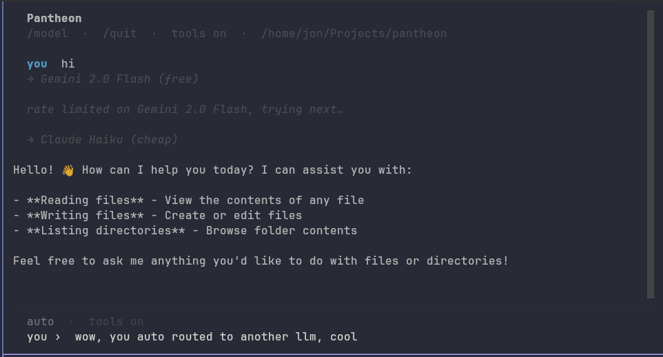

> **Warning:** This is very early and very experimental software. It is probably not worth running. Things will break, APIs will change, and there is no guarantee of stability.

```
 ██████╗  █████╗ ███╗  ██╗████████╗██╗  ██╗███████╗ ██████╗ ███╗  ██╗
 ██╔══██╗██╔══██╗████╗ ██║╚══██╔══╝██║  ██║██╔════╝██╔═══██╗████╗ ██║
 ██████╔╝███████║██╔██╗██║   ██║   ███████║█████╗  ██║   ██║██╔██╗██║
 ██╔═══╝ ██╔══██║██║╚████║   ██║   ██╔══██║██╔══╝  ██║   ██║██║╚████║
 ██║     ██║  ██║██║ ╚███║   ██║   ██║  ██║███████╗╚██████╔╝██║ ╚███║
 ╚═╝     ╚═╝  ╚═╝╚═╝  ╚══╝   ╚═╝   ╚═╝  ╚═╝╚══════╝ ╚═════╝ ╚═╝  ╚══╝
```

> *One interface. Many gods. Each request goes to the right one.*

Pantheon is a cost-aware LLM router for your terminal. Instead of burning through a single provider's token quota, `pan` routes each conversation to the cheapest model capable of handling it — Gemini Flash for quick questions, Claude Sonnet when you need the heavy hitter.

---



## How it works

```
you → pan → classifier → gemini-flash   (free)
                       → claude-haiku   (cheap)
                       → claude-sonnet  (when it matters)
```

Simple requests go to free/cheap models. Complex reasoning, nuanced writing, and hard coding problems get escalated. You pay for intelligence only when you need it.

---

## Install

```bash
git clone https://github.com/yourusername/pantheon
cd pantheon
cargo install --path .
```

## First run

```bash
pan
```

On first run, `pan` walks you through adding your first provider (Gemini Flash recommended — it's free).

---

## Usage

```bash
pan              # start a chat session
pan auth add     # add a new provider
pan auth list    # show configured providers
pan config       # view/edit routing config
```

---

## Providers

| Provider | Model | Tier | Notes |
|---|---|---|---|
| Google | Gemini 2.0 Flash | Free | Recommended starting point |
| Groq | Llama 3 | Free | Very fast inference |
| Anthropic | Claude Haiku | Cheap | Best cheap quality |
| Anthropic | Claude Sonnet | Full | Reserved for complex tasks |
| OpenAI | GPT-4o-mini | Cheap | Good structured output |

---

## Philosophy

The polytheist doesn't pray to one god for everything. Different problems call for different powers. Pantheon routes your requests accordingly.
### System Prompt
Pantheon can be started with a custom system prompt by specifying the path to a file in the ``.pantheon`` directory.

     pan -s ~/.pantheon/system_prompt.md

Example:

     cat ~/.pantheon/system_prompt.md

Hello, Pantheon!

You can also set the default system prompt to this custom prompt when starting Pantheon:

     pan --custom-system-prompt ~

Hello, Pantheon!

